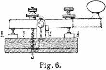

# morse-code-app-in-react :fax:

A small ReactJS app enabling encoding the text into the telegramm with use of Morse Code.



# Getting Started with Create React App

## ReactJs

A JavaScript library to build web apps
what makes React so special

- Components
- State

# files in React

## manifest.json

The web app manifest provides information about an application (such as name, author, icon, and description) in a JSON text file

## reportwebvitals

Tool for measuring the real life performance of your app(very new to React)
more on that [web-vitals](https://www.npmjs.com/package/web-vitals)

## To start React Project

```
 $ npx create-react-app <app-name>
 $ cd <app-name>
 $ npm i node-sass
 $ npm start
```

## Deploy React apps in GH pages

# step 1

Installing gh-pages package

```
$ npm install gh-pages
```

# step 2

Adding homepage into **package.json**

```
"homepage": "http://<your-gh-username>.github.io/<your-repo-name>"

```

# step 3

Adding some more scripts into **package.json**

```
"scripts": {
//...
"predeploy": "npm run build",
"deploy": "gh-pages -d build"
}
```

# step 4

Lastly run build script to generate build dir

```
$ npm rum build
$ npm run deploy
```
